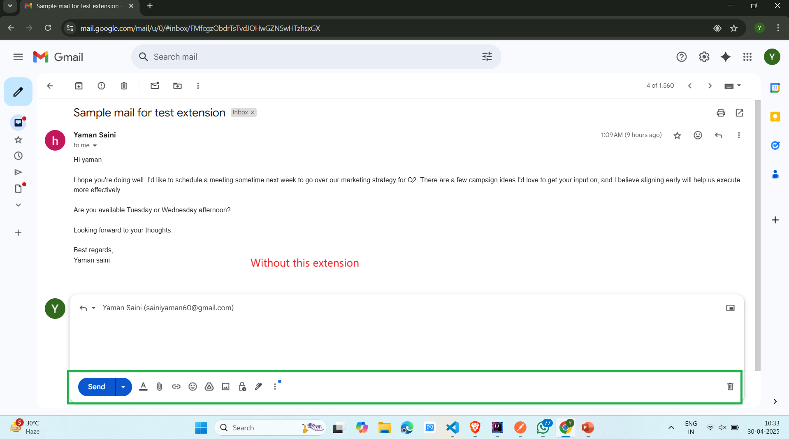
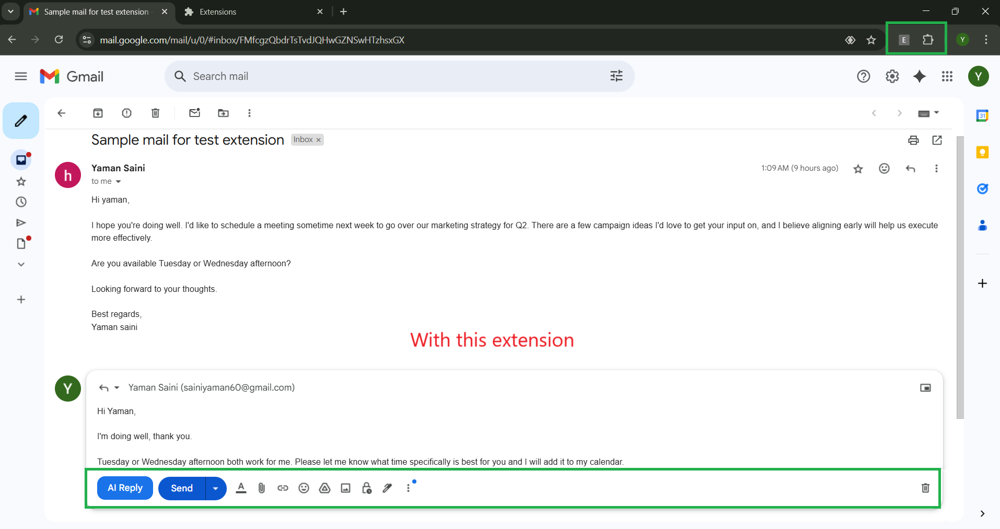

# 📬 Email Writer Assistant – AI-Powered Gmail Chrome Extension

Tired of replying to every email manually? **Email Writer Assistant** is a productivity-focused Chrome extension that leverages AI to help you draft email replies instantly, right inside your Gmail inbox. 
Whether it's professional, friendly, or casual — respond faster and smarter with just one click.

---

## 🚀 Features

- ✨ **AI-Generated Replies** within Gmail
- 🗣️ **Customizable Tone**: Professional, Friendly, Casual, etc.
- 📥 Auto-detects incoming emails and suggests context-aware responses
- 🧠 Powered by **Google Gemini AI**
- 🔘 Seamlessly injects a reply button (`AI Reply`) into Gmail's UI
- 🕒 Saves time and boosts productivity

---

## 🧰 Tech Stack

| Layer        | Technology               |
|--------------|---------------------------|
| Frontend     | React, Material UI        |
| Backend      | Spring Boot, Spring AI    |
| AI Model     | Google Gemini             |
| Browser API  | Chrome Extension APIs     |

---

## 🖼️ Screenshots

### ✉️ Without Extension  

### 🤖 With Email Writer Assistant Extension  

---

## 🛠️ Installation & Setup

### 🔹 Chrome Extension
1. Clone this repo:
   
   git clone https://github.com/yourusername/email-writer-assistant.git
